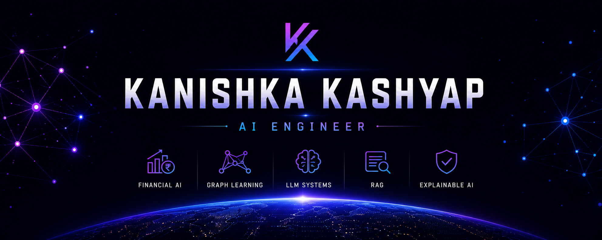

<p align="center">
  
</p>

<p align="center">

</p>

<p align="center">

<a href="https://www.linkedin.com/in/kkanishka/">

</a>

<a href="mailto:kanishka.work28@gmail.com">

</a>

<a href="YOUR_RESUME_LINK">

</a>

</p>

---

```console
kanishka@github:~$ ./initialize_profile.sh

[✓] Loading profile...
[✓] Loading projects...
[✓] Loading research...
[✓] Loading GitHub statistics...

Initialization Complete.
```

```console
kanishka@github:~$ whoami

Name          : Kanishka Kashyap

Role          : AI Engineer

Education     : B.Sc. (Hons.) Computer Science
                University of Delhi

Current       : LLM Trainer @ Outlier AI

Specialization

├── Financial AI
├── Graph Learning
├── LLM Systems
├── Retrieval-Augmented Generation
└── Explainable AI

Status

└── Open to AI / ML Opportunities
```

---

# Featured Work

<table>

<tr>

<td width="50%" valign="top">

### 🏦 Corporate Credit Rating Prediction

Research-oriented machine learning framework for corporate credit rating prediction using financial statements, ordinal learning, graph-based modeling and explainability.

</td>

<td width="50%" valign="top">

### 🤖 AI Research Copilot

An AI-powered research assistant built using modern LLM workflows, Retrieval-Augmented Generation (RAG), and intelligent document understanding.

</td>

</tr>

<tr>

<td width="50%" valign="top">

### 💹 FinPulse

Financial AI platform focused on intelligent analytics, financial insights, and AI-assisted decision support.

</td>

<td width="50%" valign="top">

### 🚀 More Coming Soon...

Always learning.
Always building.

</td>

</tr>

</table>

---

# Tech Stack

<p align="center">


</p>

---

# Research Interests

```text
• Financial Artificial Intelligence

• Graph Representation Learning

• Explainable Artificial Intelligence

• Large Language Models

• Retrieval-Augmented Generation

• AI Agents
```

---

# GitHub Analytics

<p align="center">


</p>

<p align="center">


</p>

<p align="center">


</p>

---

<p align="center">

<i>"Building intelligent systems where Artificial Intelligence meets financial decision-making."</i>

</p>

<p align="center">

⭐ Thanks for visiting my profile!

</p>
